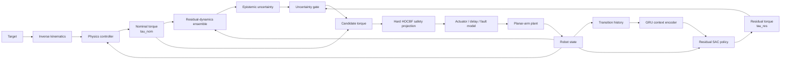

# SARRL

[](https://github.com/andrealo20/SARRL/actions/workflows/ci.yml)
[](https://www.python.org/)
[](tests/)
[](docs/changelog.md)
[](LICENSE)


## Safe Adaptive Residual Reinforcement Learning for Robotic Manipulation

**SARRL** is a research-oriented robotics and reinforcement-learning stack for control under model mismatch.

It combines:

- analytical rigid-body dynamics;
- physics-based computed-torque control;
- from-scratch Soft Actor-Critic;
- bounded residual reinforcement learning;
- domain randomization and controlled fault injection;
- causal dynamics-context estimation;
- learned residual dynamics;
- ensemble epistemic uncertainty;
- uncertainty-dependent policy authority;
- hard high-order Control Barrier Function safety projection.

The current **v1.1.0** release focuses on a fully reproducible analytical **2-DoF planar robotic arm**. MuJoCo/Franka transfer, hardware experiments and sim-to-real validation are deliberately kept outside the current claims until they are implemented and evaluated.

---

## Headline result

On the randomized planar held-out benchmark, five independently trained residual-SAC policies achieved:

```math
\boxed{
56.4\% \pm 7.0 \text{percentage points}
}
```

where the uncertainty is the **sample standard deviation across five independent training seeds**.

The computed-torque baseline achieved:

```math
\boxed{
11.0\%
}
```

on the **same 100 held-out episode seeds**.

The mean paired improvement was:

```math
\boxed{
+45.4 \text{percentage points}
}
```

and all five per-policy paired bootstrap 95% confidence intervals excluded zero.

> **Scope of this result:** this is method-specific evidence for residual SAC on the randomized analytical planar benchmark. It is not a claim about Franka, MuJoCo, hardware, sim-to-real transfer, or the full adaptive/uncertainty/safety stack as an ablated whole.

---

# Architecture

SARRL starts from a model-based controller and lets reinforcement learning learn only a bounded correction.



The architecture is deliberately modular. The controller, reinforcement-learning agent, adaptation module, residual-dynamics ensemble and safety filter can be tested independently.

---

# Core formulation

## Robot dynamics

The analytical planar arm follows the standard rigid-body manipulator equation

```math
M(q)\ddot{q}
+
C(q,\dot{q})\dot{q}
+
g(q)
+
f(\dot{q})
=
\tau
```

where:

- $q \in \mathbb{R}^2$ is the joint configuration;
- $\dot{q}$ and $\ddot{q}$ are joint velocity and acceleration;
- $M(q)$ is the inertia matrix;
- $C(q,\dot{q})\dot{q}$ contains Coriolis and centrifugal terms;
- $g(q)$ is the gravity vector;
- $f(\dot{q})$ models viscous and smoothed Coulomb friction;
- $\tau$ is the applied joint torque.

The implementation includes endpoint payload dynamics, forward and inverse dynamics, RK4 integration, forward/inverse kinematics, the analytical Jacobian and $\dot{J}(q,\dot q)\dot q$.

---

## Residual control

Instead of asking reinforcement learning to replace the entire controller,

```math
\tau = \pi(s),
```

SARRL begins from a competent physics-based controller.

The learned policy produces only a bounded residual correction:

```math
\tau_{\mathrm{candidate}}
=
\tau_{\mathrm{nom}}
+
\tau_{\mathrm{res}}.
```

With normalized SAC action $a_{\mathrm{RL}}\in[-1,1]^n$,

```math
\tau_{\mathrm{res}}
=
\tau_{\mathrm{res,max}}
\odot
a_{\mathrm{RL}}.
```

This decomposition gives the policy a much narrower task: compensate for model mismatch rather than rediscover the complete robot controller from scratch.

---

## Computed-torque baseline

The nominal controller uses feedback linearization:

```math
\tau_{\mathrm{nom}}
=
M(q)
\left[
\ddot q_d
+
K_d(\dot q_d-\dot q)
+
K_p(q_d-q)
\right]
+
C(q,\dot q)\dot q
+
g(q).
```

Under an accurate model, this approximately reduces the tracking error dynamics to

```math
\ddot e + K_d\dot e + K_p e = 0,
```

with

```math
e=q_d-q.
```

The same nominal controller is retained as the non-learned comparison baseline.

---

# Soft Actor-Critic

SARRL implements Soft Actor-Critic directly in PyTorch rather than using SB3 or RLlib.

The stochastic actor is a tanh-squashed Gaussian policy:

```math
u_\theta(s,\epsilon)
=
\mu_\theta(s)
+
\sigma_\theta(s)\odot\epsilon,
\qquad
\epsilon\sim\mathcal N(0,I),
```

followed by

```math
a
=
\tanh(u_\theta).
```

The policy objective is

```math
J_\pi(\theta)
=
\mathbb E_{s\sim\mathcal D, 
a\sim\pi_\theta}
\left[
\alpha\log\pi_\theta(a|s)
-
\min_{i\in\{1,2\}}
Q_{\phi_i}(s,a)
\right].
```

The critic target is

```math
y
=
r
+
\gamma(1-d)
\left[
\min_{i\in\{1,2\}}
Q_{\bar\phi_i}(s',a')
-
\alpha\log\pi_\theta(a'|s')
\right].
```

The implementation includes:

- twin critics;
- target critics;
- Polyak averaging;
- reparameterized Gaussian sampling;
- exact tanh change-of-variables correction;
- automatic entropy-temperature tuning;
- reproducible replay sampling;
- architecture-safe checkpoints;
- deterministic inference that does not advance the stochastic PyTorch RNG;
- exact off-policy training-session reconstruction.

---

# Dynamics randomization and faults

The analytical environment can independently vary:

- link mass and inertia;
- joint friction;
- endpoint payload;
- motor gain;
- sensor noise;
- actuator-command delay.

The retained v1.1.0 training campaign uses:

```math
\Delta m = \pm 15\%,
```

```math
\Delta f = \pm 30\%,
```

```math
\Delta k_{\mathrm{motor}} = \pm 15\%,
```

payload

```math
m_{\mathrm{payload}}\in[0,1] \mathrm{kg},
```

and actuator-command delay

```math
d\in\{0,1,2\} \text{steps}.
```

Abrupt in-episode motor-gain and payload faults are also supported for controlled fault-recovery experiments.

---

# Causal dynamics context

The adaptation module uses only transition history available at runtime.

Each history element has the form

```math
h_t
=
\left(
o_t, 
a_t, 
o_{t+1}-o_t
\right).
```

A GRU encoder maps a finite causal history

```math
H_t
=
(h_{t-L},\ldots,h_{t-1})
```

to a latent context

```math
z_t
=
f_{\mathrm{GRU}}(H_t).
```

Ground-truth dynamics parameters can be used as auxiliary supervision during training or diagnostics, but are **not required as runtime policy inputs**.

This prevents privileged physical information from leaking directly into the deployed controller.

---

# Learned residual dynamics

The nominal rigid-body model predicts acceleration

```math
\ddot q_{\mathrm{nom}}
=
f_{\mathrm{nom}}(x,\tau_{\mathrm{cmd}}).
```

The actual plant acceleration is represented as

```math
\ddot q_{\mathrm{real}}
=
\ddot q_{\mathrm{nom}}
+
\Delta\ddot q.
```

Each learned ensemble member approximates

```math
\hat r_k(x,\tau_{\mathrm{cmd}})
\approx
\Delta\ddot q.
```

The commanded torque is intentionally used as model input rather than an already-degraded applied torque, so actuator-gain mismatch remains visible in the residual target.

---

# Epistemic uncertainty

For an ensemble of $K$ residual models, the mean prediction is

```math
\bar r(x,\tau)
=
\frac{1}{K}
\sum_{k=1}^{K}
\hat r_k(x,\tau).
```

A simple disagreement measure is

```math
\sigma_r^2(x,\tau)
=
\frac{1}{K}
\sum_{k=1}^{K}
\left\|
\hat r_k(x,\tau)
-
\bar r(x,\tau)
\right\|_2^2.
```

The residual-policy authority can then be attenuated using an uncertainty-dependent gate

```math
0
\le
\lambda(\sigma_r)
\le
1,
```

giving

```math
\tau_{\mathrm{candidate}}
=
\tau_{\mathrm{nom}}
+
\lambda(\sigma_r)\tau_{\mathrm{res}}.
```

The uncertainty gate is a **robustness heuristic**.

It is **not** a safety certificate.

---

# Hard HOCBF safety projection

The safety layer modifies the candidate command only when required to satisfy hard constraints.

The projection has the generic form

```math
\tau^\star
=
\underset{\tau}{\operatorname{argmin}}
 
\frac{1}{2}
\left\|
\tau-\tau_{\mathrm{candidate}}
\right\|_2^2
```

subject to affine safety constraints

```math
A(x)\tau
\le
b(x).
```

For a relative-degree-two safety function $h(q)$, SARRL uses a high-order Control Barrier Function condition of the form

```math
\ddot h
+
\alpha_1\dot h
+
\alpha_0 h
\ge
0.
```

The planar implementation constructs constraints for:

- joint-position limits;
- one-step joint-velocity limits;
- circular Cartesian obstacles;
- actuator torque limits.

Because the action space is two-dimensional, the Euclidean projection onto the feasible polytope is solved exactly by active-set enumeration.

There is no hidden slack variable.

If the hard constraint set is infeasible, the filter reports failure explicitly. With `require_safety=True`, SARRL therefore does not silently execute an uncertified fallback command.

---

# Retained v1.1.0 learned-policy result

The first completed retained learned-policy campaign is stored under:

```text
artifacts/planar_sac_5seed/
```

## Protocol

Five independent training runs were performed with seeds:

```text
0, 1, 2, 3, 4
```

Each policy was trained for:

```text
200,000 environment steps
```

with:

```text
hidden layers       256 x 256
batch size          256
replay capacity     200,000
initial random      5,000 steps
update cadence      1 SAC update / environment step
```

Validation used:

```text
30 fixed episodes
starting seed: 20000
every 25,000 training steps
```

The selected checkpoint maximized validation success rate, with mean return used only as a tie-break.

Final evaluation used:

```text
100 held-out episodes per policy
seeds 40000 ... 40099
```

These held-out episodes were never used for checkpoint selection.

The computed-torque baseline was evaluated on the **same held-out episode seeds**.

---

## Held-out results

| Training seed | Selected step | Success | Wilson 95% CI | Mean final distance |
|---:|---:|---:|---:|---:|
| 0 | 200k | 61/100 | 51.2–70.0% | 0.0863 m |
| 1 | 200k | 57/100 | 47.2–66.3% | 0.0859 m |
| 2 | 200k | 63/100 | 53.2–71.8% | 0.0803 m |
| 3 | 150k | 56/100 | 46.2–65.3% | 0.0986 m |
| 4 | 200k | 45/100 | 35.6–54.8% | 0.0928 m |

Across the five independently trained policies,

```math
\bar p
=
\frac{1}{5}
\sum_{i=1}^{5}p_i
=
56.4\%.
```

The sample standard deviation across training seeds is

```math
s_p
=
\sqrt{
\frac{1}{5-1}
\sum_{i=1}^{5}
(p_i-\bar p)^2
}
=
7.0
 \text{percentage points}.
```

Therefore the primary multi-seed result is reported as

```math
\boxed{
56.4\% \pm 7.0 \mathrm{pp}
}
```

with an observed seed range of

```math
45\% \le p_i \le 63\%.
```

The five policies produced

```math
282/500
```

successful held-out evaluations in total.

The pooled 282/500 value is not treated as 500 independent training replicates; variability is reported across the five independently optimized policies.

---

# Paired computed-torque comparison

The computed-torque baseline achieved

```math
11/100 = 11.0\%
```

on the same held-out episode seeds.

Its Wilson 95% confidence interval is approximately

```math
6.3\% \text{ to } 18.6\%.
```

The paired policy-minus-baseline success-rate improvements were:

| Training seed | Improvement | Paired bootstrap 95% CI |
|---:|---:|---:|
| 0 | +50 pp | +37 to +62 pp |
| 1 | +46 pp | +35 to +57 pp |
| 2 | +52 pp | +40 to +63 pp |
| 3 | +45 pp | +34 to +56 pp |
| 4 | +34 pp | +22 to +46 pp |

The mean paired improvement is

```math
\boxed{
+45.4 \mathrm{percentage points}
}
```

and every per-policy paired bootstrap 95% confidence interval excludes zero.

---

# Retained evidence

The release stores the evidence required to reconstruct the reported statistics:

```text
artifacts/planar_sac_5seed/
├── README.md
├── aggregate.json
├── baseline_heldout_40000.csv
├── checkpoint_sha256.txt
├── heldout_episodes.csv
├── paired_comparison.csv
├── result.json
├── run_manifest_seed_0.json
├── run_manifest_seed_1.json
├── run_manifest_seed_2.json
├── run_manifest_seed_3.json
├── run_manifest_seed_4.json
├── summary.csv
├── validation_seed_0.csv
├── validation_seed_1.csv
├── validation_seed_2.csv
├── validation_seed_3.csv
└── validation_seed_4.csv
```

The large neural-network checkpoint files themselves are intentionally not committed.

Their SHA-256 fingerprints are retained so the exact evaluated models remain identifiable.

The training manifests identify the verified v1.0.1 training code commit used to generate the campaign:

```text
9f832614ce8b51c207873ff4861986ab72903115
```

The v1.1.0 release adds the retained experimental evidence and documentation without rewriting that provenance.

---

# Historical non-learned baselines

The repository also retains earlier computed-torque experiments:

| Scenario | Success | Wilson 95% CI | Purpose |
|---|---:|---:|---|
| nominal computed torque | 100/100 | 96.3–100.0% | controller/plant sanity check |
| in-distribution randomization | 8/100 | 4.1–15.0% | model-mismatch baseline |
| OOD dynamics | 0/100 | 0.0–3.7% | stress baseline |
| joint-2 motor fault | 1/100 | 0.2–5.4% | fault-recovery baseline |

Raw retained data:

```text
results/v0_1_nominal.csv
results/v0_9_baselines.csv
results/v0_9_baselines.json
```

These results establish that a controller which is strong under nominal dynamics can degrade sharply under structured model mismatch.

That gap motivates residual learning and adaptive control.

---

# Verification

The automated test suite currently reports **72/72 tests**, with **72 passed** in the verified release audit.

GitHub Actions runs the complete audit on:

```text
Python 3.10
Python 3.11
Python 3.12
```

The CI pipeline executes:

```bash
ruff check .
python -m compileall -q sarrl tests tools
pytest
```

The current release passes all three Python configurations.

Important regression and numerical tests cover:

- inertia-matrix symmetry and positive definiteness;
- finite-difference verification of rigid-body identities;
- forward/inverse dynamics round trips;
- analytical Jacobian vs finite differences;
- RK4 conservative-energy behavior;
- computed-torque closed-loop convergence;
- nonlinear MPC feasibility and objective improvement;
- deterministic randomization;
- sensor noise;
- command delay;
- injected faults;
- replay-buffer reproducibility;
- SAC Bellman targets;
- target-network updates;
- tanh log-probability correction;
- entropy-temperature optimization;
- deterministic policy evaluation without stochastic RNG consumption;
- architecture-safe SAC checkpoint loading;
- exact replay/environment/RNG training continuation;
- CUDA RNG-state checkpoint restoration;
- causal context-encoder behavior;
- residual-dynamics learning and checkpointing;
- motor-gain mismatch visibility;
- ensemble uncertainty;
- exact 2-D safety projection;
- HOCBF infeasibility semantics;
- runtime-stack composition;
- Wilson intervals;
- paired bootstrap comparisons;
- validation/held-out seed separation.

See [`docs/verification.md`](docs/verification.md) for the detailed verification record.

---

# Verified, measured and planned scope

| Component | Status |
|---|---|
| analytical 2-DoF rigid-body dynamics | implemented + tested |
| computed-torque controller | implemented + measured |
| nonlinear constrained MPC | implemented + tested |
| from-scratch Soft Actor-Critic | implemented + tested |
| residual SAC | implemented + multi-seed planar result retained |
| domain randomization | implemented + measured |
| actuator/payload fault injection | implemented + baseline measured |
| causal GRU dynamics context | implemented + tested |
| residual-dynamics ensemble | implemented + tested |
| epistemic uncertainty estimate | implemented + tested |
| uncertainty authority gate | implemented + tested |
| hard HOCBF safety projection | implemented + tested |
| full comparative ablation matrix | pending |
| learned-policy OOD campaign | pending |
| MuJoCo transfer | planned |
| Franka Panda transfer | planned |
| hardware experiments | planned |
| sim-to-real validation | planned |

---

# Installation

Clone the repository:

```bash
git clone https://github.com/andrealo20/SARRL.git
cd SARRL
```

Create a virtual environment if desired:

```bash
python -m venv .venv
```

Linux/macOS:

```bash
source .venv/bin/activate
```

Windows:

```powershell
.venv\Scripts\Activate.ps1
```

Install:

```bash
python -m pip install -e .
```

Run the tests:

```bash
pytest -q
```

For development tools:

```bash
python -m pip install -e '.[dev]'
ruff check .
pytest -q
```

The analytical planar stack requires only:

- NumPy;
- SciPy;
- PyTorch.

MuJoCo and Gymnasium are not required by the current reference release.

---

# Quick experiments

## Nominal computed-torque baseline

```bash
python tools/evaluate_nominal.py \
  --episodes 100 \
  --seed 1000 \
  --output results/nominal.csv
```

---

## Train residual SAC

```bash
python tools/train_sac.py \
  --mode residual \
  --randomize \
  --steps 200000 \
  --seed 0 \
  --output results/residual_seed0
```

Training uses a dedicated fixed validation set for model selection.

---

## Resume an exact training session

```bash
python tools/train_sac.py \
  --steps 400000 \
  --resume results/residual_seed0/training_final.pt \
  --output results/residual_seed0
```

The training checkpoint reconstructs more than network weights. It includes replay state, environment state, architecture, optimization state and RNG state required for reproducible off-policy continuation.

---

## Held-out policy evaluation

```bash
python tools/evaluate.py \
  results/residual_seed0/best.pt \
  --mode residual \
  --episodes 100 \
  --seed 40000
```

---

## Five-seed campaign

```bash
python tools/run_sac_sweep.py \
  --seeds 0 1 2 3 4 \
  --mode residual \
  --randomize \
  --steps 200000 \
  --validation-seed 20000 \
  --heldout-seed 40000 \
  --heldout-episodes 100 \
  --output results/residual_sweep
```

The sweep runner refuses overlapping validation and held-out seed ranges.

Generated outputs include:

```text
sweep_manifest.json
summary.csv
heldout_episodes.csv
aggregate.json
seed_0/
seed_1/
seed_2/
seed_3/
seed_4/
```

---

## Train the context encoder

```bash
python tools/train_context.py \
  --samples 2000 \
  --history 16 \
  --steps 1500 \
  --output results/context/context.pt
```

---

## Train a residual-dynamics ensemble

```bash
python tools/train_residual_dynamics.py \
  --samples 10000 \
  --steps 2000 \
  --output results/residual_dynamics/ensemble.pt
```

---

## Evaluate the composed runtime stack

```bash
python tools/evaluate_stack.py \
  results/residual_seed0/best.pt \
  --episodes 100 \
  --randomize \
  --safety
```

---

# Experimental discipline

SARRL separates three statistically different seed populations:

```text
training seeds
    ↓
independent policy optimization

validation seeds
    ↓
checkpoint selection only

held-out seeds
    ↓
final reported evaluation only
```

Formally,

```math
\mathcal S_{\mathrm{train}}
\cap
\mathcal S_{\mathrm{validation}}
=
\varnothing,
```

```math
\mathcal S_{\mathrm{train}}
\cap
\mathcal S_{\mathrm{test}}
=
\varnothing,
```

and

```math
\mathcal S_{\mathrm{validation}}
\cap
\mathcal S_{\mathrm{test}}
=
\varnothing.
```

The held-out population must not influence checkpoint selection.

For learned-policy comparisons, SARRL reports variation across **independently trained models**, not only binomial uncertainty across episodes from a single model.

Every training run writes a machine-readable manifest containing:

- Git commit;
- Python version;
- library versions;
- device information;
- agent configuration;
- environment configuration;
- domain-randomization parameters;
- validation protocol;
- training configuration.

---

# Repository structure

```text
SARRL/
├── sarrl/
│   ├── adaptation/       # causal GRU context estimation
│   ├── controllers/      # computed torque and nonlinear MPC
│   ├── dynamics/         # analytical planar-arm dynamics
│   ├── envs/             # randomized/faulted reaching environment
│   ├── evaluation/       # statistics and fixed-seed protocols
│   ├── models/           # residual dynamics and uncertainty
│   ├── rl/               # SAC, networks, replay and checkpoints
│   ├── runtime/          # composed SARRL control stack
│   ├── safety/           # hard HOCBF projection
│   └── utils/            # seeding and lightweight utilities
│
├── tools/
│   ├── train_sac.py
│   ├── run_sac_sweep.py
│   ├── evaluate.py
│   ├── evaluate_nominal.py
│   ├── evaluate_stack.py
│   ├── train_context.py
│   ├── train_residual_dynamics.py
│   └── run_planar_baselines.py
│
├── artifacts/
│   └── planar_sac_5seed/ # retained v1.1.0 learned-policy evidence
│
├── results/              # retained historical baselines
├── tests/                # 72 automated tests
├── configs/
└── docs/
    ├── design.md
    ├── mathematics.md
    ├── experiments.md
    ├── verification.md
    └── changelog.md
```

---

# Milestones

| Milestone | Scope | Status |
|---|---|---|
| M0 | analytical 2-DoF dynamics | implemented + tested |
| M1 | computed-torque baseline | implemented + measured |
| M2 | nonlinear constrained MPC | implemented + tested |
| M3 | SAC from scratch | implemented + tested |
| M4 | direct-torque RL path | implemented; full campaign pending |
| M5 | residual SAC | implemented + five-seed planar campaign |
| M6 | domain randomization + OOD protocol | implemented |
| M7 | causal GRU dynamics context | implemented + tested |
| M8 | actuator/payload fault injection | implemented |
| M9 | hard HOCBF projection | implemented + tested |
| **M10** | **MuJoCo + Franka Panda transfer** | **planned / not claimed** |
| M11 | learned residual dynamics | implemented + tested |
| M12 | ensemble epistemic uncertainty | implemented + tested |

---

# Current limitations

The current release intentionally has several boundaries.

- The retained reference plant is an analytical **2-DoF planar arm**, not a 7-DoF Franka Panda.
- No hardware-control performance claim is made.
- No sim-to-real claim is made.
- The retained multi-seed result evaluates residual SAC only.
- The complete comparative ablation matrix remains pending.
- Learned-policy OOD evaluation is not yet retained as a release-level result.
- The SciPy/SLSQP MPC implementation is a reference nonlinear controller, not a hard real-time optimization solver.
- The HOCBF guarantee is model-relative; model uncertainty remains relevant.
- Ensemble disagreement is an epistemic-uncertainty heuristic, not a calibrated probabilistic guarantee.
- The uncertainty gate is a robustness mechanism and must not be interpreted as a formal safety certificate.

These are explicit boundaries of the evidence rather than hidden assumptions.

---

# Documentation

More detailed technical material is available in:

- [`docs/design.md`](docs/design.md) — architecture and design decisions;
- [`docs/mathematics.md`](docs/mathematics.md) — mathematical formulation;
- [`docs/experiments.md`](docs/experiments.md) — experimental protocol;
- [`docs/verification.md`](docs/verification.md) — executed verification and retained evidence;
- [`docs/changelog.md`](docs/changelog.md) — release history.

---

# Reproducibility

The main v1.1.0 result can be independently checked from the committed data without access to the original neural-network checkpoint files.

The repository retains:

- raw episode outcomes;
- validation trajectories;
- training configurations;
- Git provenance;
- model fingerprints;
- paired baseline data;
- aggregate statistics.

For the retained result,

```math
\text{Residual SAC}
=
56.4\%\pm7.0 \mathrm{pp},
```

```math
\text{Computed torque}
=
11.0\%,
```

```math
\Delta_{\mathrm{paired}}
=
+45.4 \mathrm{pp}.
```

---

# License

SARRL is released under the [MIT License](LICENSE).

---

# Author

**Andrea Loroni**

GitHub: [@andrealo20](https://github.com/andrealo20)

---

## Citation

If SARRL is useful for your research or serves as a reference implementation, please cite the repository.

```bibtex
@software{loroni_sarrl_2026,
  author  = {Andrea Loroni},
  title   = {SARRL: Safe Adaptive Residual Reinforcement Learning for Robotic Manipulation},
  year    = {2026},
  version = {1.1.0},
  url     = {https://github.com/andrealo20/SARRL}
}
```
