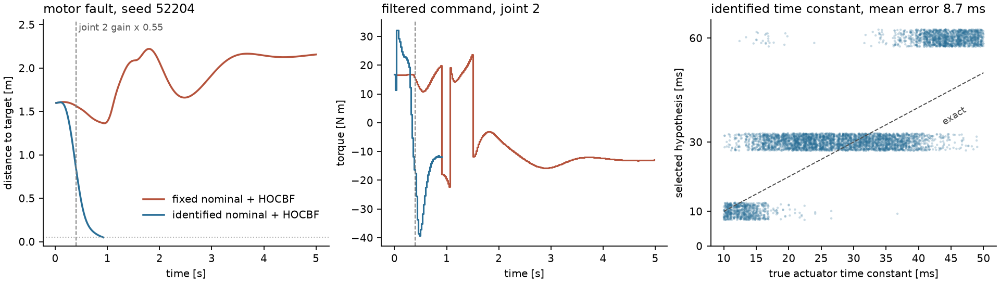

# SARRL

[](https://github.com/andrealo20/SARRL/actions/workflows/ci.yml)
[](https://github.com/andrealo20/SARRL/actions/workflows/dynamic/github-code-scanning/codeql)
[](https://github.com/andrealo20/SARRL/releases/latest)
[](https://www.python.org/)
[](LICENSE)


**SARRL** (Safe Adaptive Residual Reinforcement Learning) is a research stack for robotic control under model mismatch. It combines model-based control with bounded residual reinforcement learning, learned dynamics context, uncertainty-aware policy authority and HOCBF safety filtering.

The reference platform is a reproducible **2-DoF planar arm**, available as an analytical model and, since v2.0, as a MuJoCo plant with unmodelled actuator dynamics. Franka Panda, hardware and sim-to-real results are not currently claimed.

## Results

### Task success

On the randomized planar held-out benchmark:

| Controller | In distribution (v1.2 held-out) | Compound OOD (v1.3) | Motor fault (v1.3) |
|---|---:|---:|---:|
| Computed torque | 11.0% | 0.0% | 3.0% |
| Direct SAC | 6.0% ± 3.7 pp | n/a | n/a |
| Residual SAC | 56.4% ± 7.0 pp | 6.0% ± 2.3 pp | 23.6% ± 1.9 pp |
| Residual SAC + learned context | **64.2% ± 6.7 pp** | **11.6% ± 3.8 pp** | **32.6% ± 6.4 pp** |
| Residual SAC + uncertainty gate | 15.2% ± 1.6 pp | 0.0% | 3.2% ± 0.8 pp |
| Residual SAC + HOCBF | 49.2% ± 7.9 pp | 3.0% ± 0.7 pp | 16.4% ± 1.1 pp |
| Full adaptive stack | 17.0% ± 2.3 pp | 0.0% | 2.8% ± 0.4 pp |
| **Identified nominal + HOCBF (v1.9, no learning)** | **91.0%** | **85.0%** | **92.0%** |
| Fixed nominal + HOCBF, MuJoCo plant (v2.0) | 11.7% | 0.1% | 3.7% |
| **Identified nominal + HOCBF, MuJoCo plant (v2.0, no learning)** | **90.9%** | **78.9%** | **90.9%** |
| Identified nominal + HOCBF on the fixed model, MuJoCo plant (v2.1) | 85.7% | 34.6% | 58.2% |
| Fixed nominal + HOCBF on the identified model, MuJoCo plant (v2.1) | 11.2% | 0.0% | 2.8% |

The v1.2 campaign established the benefit of residual learning over Direct SAC. The v1.3 campaign reused the frozen policies on new paired seeds: every learned controller degraded sharply under compound OOD dynamics and abrupt motor loss. Learned context retained the highest success, but did not solve robustness. The gate stayed near minimum authority, and hard-HOCBF stacks explicitly rejected 86/3,000 episodes when projection became infeasible.

v1.5 tested whether calibrating that gate fixes the problem. Ensemble
disagreement correlated with prediction error (median Spearman rho `0.298`,
95% CI `[0.228, 0.356]`), but the calibrated gate still reduced success. A4c
lost 13.0 pp versus A2 on ID; A6c lost 12.2 pp versus an otherwise identical
gate-off control. Both preregistered acceptance decisions failed. This is a
retained negative result: disagreement is informative about model error, but
direct residual attenuation is not useful in this benchmark.

v1.6 then tested the link v1.5 had assumed rather than measured, whether
disagreement carries information about *operational failure*, not just about
model error. On the gate-off arm, over a fixed early window and against a
composite endpoint of unsafe episode or HOCBF abort, the per-scenario AUCs were
`0.520` in distribution (24/500 events) and `0.479` under compound OOD (92/500).
The preregistered decision is **Inconclusive**: `ood_compound` excludes an
association above `AUC 0.60`, but `id_reference` does not. Neither establishes
the absence of all weaker associations (weaker effects remain plausible,
particularly because `id_reference` is unresolved), and neither identifies any
causal relationship. The screen used a
decision rule corrected before the data were opened, after the original bound was
found anticonservative; calibrated joint power was only 38.5% at AUC 0.70 against
an 80% target, so a non-rejection is inconclusive, never evidence of absence. The conditional
intervention arm was closed unexecuted.

v1.7 and v1.8 turned to training. Training residual SAC *through* the
required HOCBF filter, instead of bolting the filter on afterwards, cost
**17.3 pp** of in-distribution success (`[-23.6, -9.8]`, all five seeds
negative) with no change in safety, a preregistered **no-go**. Halving the
terminal penalty on filter aborts recovered `+4.5 pp` with an interval crossing
zero and three positive seeds out of five: **inconclusive**. An exploratory
diagnosis on the frozen v1.8 policies then located the failure mode outside the
learned component. Of 3,473 in-distribution timeouts, one ends within 5 cm of
the target; the policies stop short. With the residual removed, the bare
computed-torque nominal stops even farther away, at the equilibrium where the
joint error supplies the torque that balances the real payload and motor gain
against the fixed nominal model. A single integral-augmented nominal removed
that stop on the motivating cases but drove a joint 1.2 rad past its limit on
the fault case, because the HOCBF certificate uses the same fixed model and
predicted `-25.6 rad/s^2` of braking where the plant delivered `-0.1`. That
candidate was vetoed on safety. The nominal controller and the safety
certificate share one model, and both are wrong by the same amount when the
plant departs from it.

v1.9 replaced that fixed model with one identified online. Each joint's
torque equation, divided by its motor gain, is linear in seven parameters
and has the sent command on its left-hand side, so recursive least squares on
the measured velocity identifies masses, inertias, payload, friction and gain
together; one estimator per candidate actuator lag runs in parallel and the
best-fitting lag is used to predict the state at which the next command will
act. The identified model drives both the computed-torque nominal and the
HOCBF certificate. On 1,900 fresh paired episodes per scenario, behind the
same filter, success rose from **12.6% to 90.0%** in distribution, from
**3.1% to 90.2%** under motor fault and from **0.1% to 81.6%** under compound
OOD, while unsafe episodes fell in every scenario (`-4.7`, `-24.3` and
`-10.8 pp`, all intervals excluding zero). The preregistered decision is
**go**. On the v1.3 seeds the adaptive filtered stack reaches 91%, 92% and 85%
success, against 62%, 33% and 12% for the best learned policy on the same
seeds. No learning is involved in this result.

v2.0 moved the plant to MuJoCo and added what the controller does not model:
reflected motor inertia and a first-order actuator lag drawn per episode, and
a noisy measured state handed to every arm. The estimator gained a bank of
actuator time-constant hypotheses alongside its lag hypotheses. Behind the
same filter, on 1,900 fresh paired episodes per scenario, success rose from
**11.7% to 90.9%** in distribution, from **3.7% to 90.9%** under motor fault
and from **0.1% to 78.9%** under compound OOD; unsafe episodes were held in
distribution (`-0.8 pp`, interval covering zero) and fell under fault and OOD
(`-28.5` and `-9.3 pp`), while OOD aborts rose by `3.9 pp`. The preregistered
decision is **go**. Without noise or actuator effects the MuJoCo plant
reproduces the analytical outcomes on the v1.3 seeds in 99..100% of episodes,
so the plant port alone does not move the baseline.

v2.1 asked which use of the estimate carries that result, by crossing the
controller stack (fixed or identified) with the model behind the HOCBF
certificate (fixed or identified) on 1,900 fresh paired seeds per scenario.
The controller stack accounts for most of the success (`+74.4`, `+54.8`
and `+34.6 pp` at a fixed certificate in distribution, under fault and
under OOD), and the certificate's model adds the rest given that stack:
`+32.0 pp` under fault, `+44.7 pp` under OOD, and `+4.3 pp` `[+3.1, +5.4]`
in distribution, where the protocol had preregistered equivalence within
3 points, so the outcome is **partial** with two statements confirmed and
the third failed in the direction of a gain. The certificate's model does
nothing for the fixed controller. On safety the two certificates trade:
the fixed-model certificate intervenes in 53% to 88% of steps and stalls
the arm; the identified one intervenes in 35% to 42%, has more unsafe
episodes in distribution (`+8.5 pp`) and fewer under fault (`-15.3 pp`),
and when it is wrong it is wrong by thousandths of a radian rather than
tenths.



Left and centre: one motor-fault decision episode on the MuJoCo plant, the
first seed on which the retained log records a timeout for the fixed nominal
and a clean success for the identified one. The joint 2 gain drops to 0.55 at
0.4 s while both arms are mid-motion; the identified nominal reaches the
target at 0.9 s, the fixed nominal drifts and settles about two metres from
it. Right:
the actuator time constant selected by the hypothesis bank against the true
one for all 5,700 adaptive decision episodes; the grid is `{0, 10, 30, 60} ms`
and the selection favours the slower hypothesis from about 38 ms. The figure
is regenerated by `python -m tools.make_v20_figure` from the retained table.

Learned-policy values are means ± sample SD across five independently trained policies, with 100 episodes per policy and scenario. The v1.9 row is a single deterministic controller on the same 100 seeds per scenario (the v1.3 `50000..50099` seeds, run as the reproduction block of the v1.9 campaign); its decision rests on 1,900 further paired seeds per scenario. The two v2.0 rows are the decision block of that campaign: 1,900 paired seeds per scenario (`52200..54099`) on the MuJoCo plant with per-episode armature, first-order actuator lag and a noisy measured state, so they are not seed-matched to the rows above. The two v2.1 rows are the crossed arms of the certificate factorial on 1,900 paired seeds per scenario (`54200..56099`), same plant and options. Evidence remains limited to the planar benchmark, analytical and MuJoCo.

### Safety

Task success alone cannot separate a controller that reaches the target through the safe set from one that reaches it by traversing constraint violations. The v1.4 campaign re-evaluated the same frozen policies on the same seeds and measured the safety envelope directly, isolating the effect of the hard-HOCBF filter:

| Condition | Unsafe episodes, ID | Compound OOD | Motor fault | Success, ID |
|---|---:|---:|---:|---:|
| Residual SAC, unfiltered | 72.6% ± 3.6 pp | 67.8% ± 1.9 pp | 75.6% ± 3.3 pp | 52.2% ± 7.7 pp |
| **+ hard HOCBF** | **4.0% ± 1.6 pp** | **19.6% ± 2.6 pp** | **21.6% ± 1.3 pp** | 47.6% ± 7.3 pp |
| Full adaptive stack, pre-filter | 64.2% ± 0.4 pp | 74.6% ± 1.1 pp | 71.6% ± 0.9 pp | 14.6% ± 1.3 pp |
| **+ hard HOCBF** | **8.2% ± 0.4 pp** | **27.4% ± 0.5 pp** | **27.4% ± 1.1 pp** | 12.8% ± 0.8 pp |

Measured as a paired difference per trained model on identical episode seeds, the filter removed 68.6 pp of unsafe episodes on the ID reference for the plain residual policy and 56.0 pp for the full stack. All 15 per-model paired bootstrap intervals excluded zero in every scenario for both pairings, while the paired success cost (-4.6 pp and -1.8 pp) excluded zero in only 4/15 and 0/15 comparisons.

The unfiltered conditions were never trained against the safety envelope, so their violation rates characterize the baseline rather than a defect introduced by residual learning; the claim this campaign supports is the paired filter effect. Filtering reduces violations without eliminating them, because the HOCBF certificate covers the nominal instantaneous command model only.

See [`docs/experiments.md`](docs/experiments.md) and [`docs/verification.md`](docs/verification.md) for the protocol, retained evidence and provenance.

## How it works

SARRL starts from a physics-based controller and lets SAC learn only a bounded correction:

```math
\tau_{candidate}=\tau_{nominal}+\tau_{residual}
```

This narrows the learning problem to compensating for model mismatch. The repository also includes domain randomization, fault injection, a causal GRU context encoder, residual-dynamics ensembles, uncertainty gating and hard HOCBF projection. Components are modular and independently testable.

## Quick start

```bash
git clone https://github.com/andrealo20/SARRL.git
cd SARRL
python -m pip install -e '.[dev]'
pytest -q
```

The planar stack requires NumPy, SciPy and PyTorch. The MuJoCo plant needs the optional `mujoco` extra (`pip install -e '.[mujoco]'`); its tests skip without it. Training and evaluation commands are documented in [`docs/experiments.md`](docs/experiments.md).

## Repository guide

- `sarrl/`: dynamics, controllers, RL, adaptation and safety
- `tools/`: training, evaluation and sweep commands
- `tests/`: automated verification
- `artifacts/` and `results/`: retained experimental evidence
- `docs/`: [design](docs/design.md), [mathematics](docs/mathematics.md), [experiments](docs/experiments.md), [verification](docs/verification.md) and [changelog](docs/changelog.md)

## Limitations

The v1.3 OOD/fault, v1.4 quantified-safety, v1.5 gate-calibration, v1.6 disagreement/failure, v1.7 safety-aware training, v1.8 penalty-ablation, v1.9 adaptive-nominal, v2.0 MuJoCo and v2.1 certificate-factorial campaigns are complete; MuJoCo, Franka, hardware and sim-to-real campaigns remain future work. The v1.6 screen was deliberately a low-power feasibility screen: calibrated joint power was 38.5% at AUC 0.70, and the in-distribution arm contained 24 composite events in 500 episodes. HOCBF guarantees are model-relative: physical violations remain possible under randomized dynamics, actuator delay and injected faults even when the nominal executed-command margin is non-negative. Ensemble disagreement is neither calibrated probability nor a formal safety certificate.

## License and citation

Released under the [MIT License](LICENSE) by [Andrea Loroni](https://github.com/andrealo20).

```bibtex
@software{loroni_sarrl_2026,
  author  = {Andrea Loroni},
  title   = {SARRL: Safe Adaptive Residual Reinforcement Learning for Robotic Manipulation},
  year    = {2026},
  version = {2.1.0},
  url     = {https://github.com/andrealo20/SARRL}
}
```
