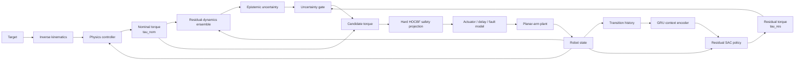

# SARRL

[](https://github.com/andrealo20/SARRL/actions/workflows/ci.yml)
[](https://www.python.org/)
[](tests/)
[](docs/changelog.md)
[](LICENSE)


**SARRL** is a research-oriented robotics and reinforcement-learning stack for control under model mismatch.

It combines:

- analytical rigid-body dynamics;
- physics-based computed-torque control;
- from-scratch Soft Actor-Critic;
- bounded residual reinforcement learning;
- domain randomization and controlled fault injection;
- causal dynamics-context estimation;
- learned residual dynamics;
- ensemble epistemic uncertainty;
- uncertainty-dependent policy authority;
- hard high-order Control Barrier Function safety projection.

The current **v1.1.0** release focuses on a fully reproducible analytical **2-DoF planar robotic arm**. MuJoCo/Franka transfer, hardware experiments and sim-to-real validation are deliberately kept outside the current claims until they are implemented and evaluated.

---

## Headline result

On the randomized planar held-out benchmark, five independently trained residual-SAC policies achieved:

```math
\boxed{
56.4\% \pm 7.0 \text{percentage points}
}
```

where the uncertainty is the **sample standard deviation across five independent training seeds**.

The computed-torque baseline achieved:

```math
\boxed{
11.0\%
}
```

on the **same 100 held-out episode seeds**.

The mean paired improvement was:

```math
\boxed{
+45.4 \text{percentage points}
}
```

and all five per-policy paired bootstrap 95% confidence intervals excluded zero.

> **Scope of this result:** this is method-specific evidence for residual SAC on the randomized analytical planar benchmark. It is not a claim about Franka, MuJoCo, hardware, sim-to-real transfer, or the full adaptive/uncertainty/safety stack as an ablated whole.

---

## Architecture

SARRL starts from a model-based controller and lets reinforcement learning learn only a bounded correction.



The architecture is deliberately modular: the controller, reinforcement-learning agent, adaptation module, residual-dynamics ensemble and safety filter can be tested independently.

---

## Residual control

SARRL begins from a competent physics-based controller. The learned policy produces only a bounded residual correction:

```math
\tau_{\mathrm{candidate}} = \tau_{\mathrm{nom}} + \tau_{\mathrm{res}}, \qquad \tau_{\mathrm{res}} = \tau_{\mathrm{res,max}} \odot a_{\mathrm{RL}}
```

with normalized SAC action $a_{\mathrm{RL}}\in[-1,1]^n$. This decomposition gives the policy a much narrower task: compensate for model mismatch rather than rediscover the complete robot controller from scratch. The full manipulator-dynamics, computed-torque, SAC, domain-randomization, causal-context, learned-residual-dynamics and HOCBF-safety derivations are in [`docs/mathematics.md`](docs/mathematics.md).

---

## Results

The first completed retained learned-policy campaign (`artifacts/planar_sac_5seed/`) trained five independent residual-SAC policies for 200,000 steps each under domain randomization, selected checkpoints on a disjoint validation set, and evaluated all five plus the computed-torque baseline on the same 100 held-out episode seeds.

| Training seed | Selected step | Success | Wilson 95% CI | Mean final distance |
|---:|---:|---:|---:|---:|
| 0 | 200k | 61/100 | 51.2–70.0% | 0.0863 m |
| 1 | 200k | 57/100 | 47.2–66.3% | 0.0859 m |
| 2 | 200k | 63/100 | 53.2–71.8% | 0.0803 m |
| 3 | 150k | 56/100 | 46.2–65.3% | 0.0986 m |
| 4 | 200k | 45/100 | 35.6–54.8% | 0.0928 m |

The full training protocol, the paired computed-torque comparison and the retained-evidence provenance are in [`docs/experiments.md`](docs/experiments.md) and [`docs/verification.md`](docs/verification.md).

---

## Verified, measured and planned

| Component | Status |
|---|---|
| analytical 2-DoF rigid-body dynamics | implemented + tested |
| computed-torque controller | implemented + measured |
| nonlinear constrained MPC | implemented + tested |
| from-scratch Soft Actor-Critic | implemented + tested |
| residual SAC | implemented + multi-seed planar result retained |
| domain randomization | implemented + measured |
| actuator/payload fault injection | implemented + baseline measured |
| causal GRU dynamics context | implemented + tested |
| residual-dynamics ensemble | implemented + tested |
| epistemic uncertainty estimate | implemented + tested |
| uncertainty authority gate | implemented + tested |
| hard HOCBF safety projection | implemented + tested |
| full comparative ablation matrix | pending |
| learned-policy OOD campaign | pending |
| MuJoCo transfer | planned |
| Franka Panda transfer | planned |
| hardware experiments | planned |
| sim-to-real validation | planned |

---

## Milestones & roadmap

| Milestone | Scope | Status |
|---|---|---|
| M0 | analytical 2-DoF dynamics | implemented + tested |
| M1 | computed-torque baseline | implemented + measured |
| M2 | nonlinear constrained MPC | implemented + tested |
| M3 | SAC from scratch | implemented + tested |
| M4 | direct-torque RL path | implemented; full campaign pending |
| M5 | residual SAC | implemented + five-seed planar campaign |
| M6 | domain randomization + OOD protocol | implemented |
| M7 | causal GRU dynamics context | implemented + tested |
| M8 | actuator/payload fault injection | implemented |
| M9 | hard HOCBF projection | implemented + tested |
| **M10** | **MuJoCo + Franka Panda transfer** | **planned / not claimed** |
| M11 | learned residual dynamics | implemented + tested |
| M12 | ensemble epistemic uncertainty | implemented + tested |

Near-term priorities: the full comparative ablation matrix, a learned-policy OOD campaign, a dedicated HOCBF safety-metrics campaign, and MuJoCo/Franka Panda transfer — in that order. Details for each are in [`docs/experiments.md`](docs/experiments.md).

---

## Installation

```bash
git clone https://github.com/andrealo20/SARRL.git
cd SARRL
python -m pip install -e .
pytest -q
```

The analytical planar stack requires only NumPy, SciPy and PyTorch — MuJoCo and Gymnasium are not required by the current reference release. For development tools use `python -m pip install -e '.[dev]'` and `ruff check .`. Training, sweep and evaluation commands are in [`docs/experiments.md`](docs/experiments.md).

---

## Verification

The automated test suite currently reports **72/72 tests**, with **72 passed** in the verified release audit, across Python 3.10, 3.11 and 3.12. See [`docs/verification.md`](docs/verification.md) for the full test-coverage checklist and retained evidence.

---

## Repository structure

```text
SARRL/
├── sarrl/       # controllers, dynamics, RL, adaptation, safety, runtime
├── tools/       # training, evaluation and sweep scripts
├── artifacts/   # retained v1.1.0 learned-policy evidence
├── results/     # retained historical baselines
├── tests/       # 72 automated tests
├── configs/
└── docs/        # design, mathematics, experiments, verification, changelog
```

---

## Current limitations

- The retained reference plant is an analytical **2-DoF planar arm**, not a 7-DoF Franka Panda; no hardware or sim-to-real claim is made.
- The retained multi-seed result evaluates residual SAC only — the full comparative ablation matrix and learned-policy OOD evaluation remain pending.
- The SciPy/SLSQP MPC implementation is a reference nonlinear controller, not a hard real-time optimization solver.
- The HOCBF guarantee is model-relative, and ensemble disagreement is an epistemic-uncertainty heuristic rather than a calibrated probabilistic guarantee.
- The uncertainty gate is a robustness mechanism and must not be interpreted as a formal safety certificate.

These are explicit boundaries of the evidence rather than hidden assumptions.

---

## Documentation

- [`docs/design.md`](docs/design.md) — architecture and design decisions;
- [`docs/mathematics.md`](docs/mathematics.md) — full mathematical formulation;
- [`docs/experiments.md`](docs/experiments.md) — experimental protocol and commands;
- [`docs/verification.md`](docs/verification.md) — executed verification and retained evidence;
- [`docs/changelog.md`](docs/changelog.md) — release history.

---

## License

SARRL is released under the [MIT License](LICENSE).

---

## Author

**Andrea Loroni**

GitHub: [@andrealo20](https://github.com/andrealo20)

---

## Citation

If SARRL is useful for your research or serves as a reference implementation, please cite the repository.

```bibtex
@software{loroni_sarrl_2026,
  author  = {Andrea Loroni},
  title   = {SARRL: Safe Adaptive Residual Reinforcement Learning for Robotic Manipulation},
  year    = {2026},
  version = {1.1.0},
  url     = {https://github.com/andrealo20/SARRL}
}
```
