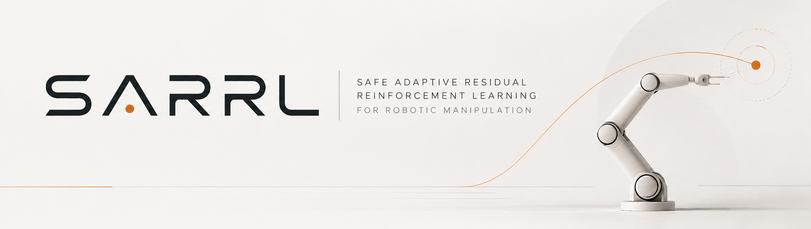

# SARRL

[](https://github.com/andrealo20/SARRL/actions/workflows/ci.yml)
[](https://www.python.org/)
[](docs/changelog.md)
[](LICENSE)



**SARRL** (Safe Adaptive Residual Reinforcement Learning) is a research stack for robotic control under model mismatch. It combines model-based control with bounded residual reinforcement learning, learned dynamics context, uncertainty-aware policy authority and HOCBF safety filtering.

The current reference platform is a reproducible analytical **2-DoF planar arm**. MuJoCo, Franka Panda, hardware and sim-to-real results are not currently claimed.

## Results

On the randomized planar held-out benchmark:

| Controller | Held-out success |
|---|---:|
| Computed torque | 11.0% |
| Direct SAC | 6.0% ± 3.7 pp |
| Residual SAC | 56.4% ± 7.0 pp |
| Residual SAC + learned context | **64.2% ± 6.7 pp** |
| Residual SAC + uncertainty gate | 15.2% ± 1.6 pp |
| Residual SAC + HOCBF | 49.2% ± 7.9 pp |
| Full adaptive stack | 17.0% ± 2.3 pp |

Residual SAC improved over Direct SAC by **+50.4 percentage points on average**. All five paired bootstrap 95% confidence intervals excluded zero. Direct SAC did not demonstrate an improvement over computed torque.

The frozen uncertainty gate was a negative ablation: it operated near its minimum authority and reduced success in A4 and A6. HOCBF filtering also reduced A5 success by 7.2 points versus paired Residual SAC and reported 15 infeasible episodes.

The learned-policy values use five independent training seeds and 100 held-out episodes per policy. The uncertainty shown is the sample standard deviation across training seeds. Evidence is limited to the analytical planar benchmark.

See [`docs/experiments.md`](docs/experiments.md) and [`docs/verification.md`](docs/verification.md) for the protocol, retained evidence and provenance.

## How it works

SARRL starts from a physics-based controller and lets SAC learn only a bounded correction:

```math
\tau_{candidate}=\tau_{nominal}+\tau_{residual}
```

This narrows the learning problem to compensating for model mismatch. The repository also includes domain randomization, fault injection, a causal GRU context encoder, residual-dynamics ensembles, uncertainty gating and hard HOCBF projection. Components are modular and independently testable.

## Quick start

```bash
git clone https://github.com/andrealo20/SARRL.git
cd SARRL
python -m pip install -e '.[dev]'
pytest -q
```

The planar stack requires NumPy, SciPy and PyTorch; MuJoCo and Gymnasium are not required. Training and evaluation commands are documented in [`docs/experiments.md`](docs/experiments.md).

## Repository guide

- `sarrl/` — dynamics, controllers, RL, adaptation and safety
- `tools/` — training, evaluation and sweep commands
- `tests/` — automated verification
- `artifacts/` and `results/` — retained experimental evidence
- `docs/` — [design](docs/design.md), [mathematics](docs/mathematics.md), [experiments](docs/experiments.md), [verification](docs/verification.md) and [changelog](docs/changelog.md)

## Limitations

The v1.2 planar ablation is complete, but learned-policy OOD, MuJoCo, Franka, hardware and sim-to-real campaigns remain future work. HOCBF guarantees are model-relative, ensemble disagreement is not calibrated probability, and the uncertainty gate is not a formal safety certificate.

## License and citation

Released under the [MIT License](LICENSE) by [Andrea Loroni](https://github.com/andrealo20).

```bibtex
@software{loroni_sarrl_2026,
  author  = {Andrea Loroni},
  title   = {SARRL: Safe Adaptive Residual Reinforcement Learning for Robotic Manipulation},
  year    = {2026},
  version = {1.2.0},
  url     = {https://github.com/andrealo20/SARRL}
}
```
